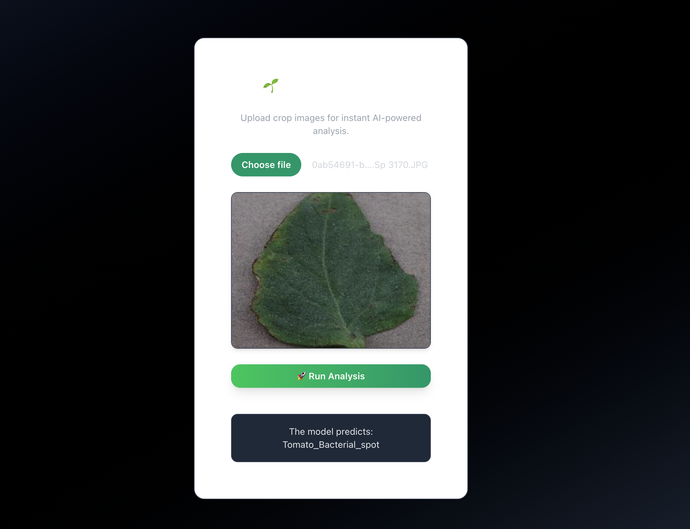

# AgriRakshak
# 🌱 AgriRakshak: AI-based Crop Pest & Disease Detection




## 📖 Description  
**AgriRakshak** is an AI-powered mobile + web solution designed to help farmers detect **crop pests and diseases in real-time** using machine learning.  
By simply capturing an image of a crop, farmers receive instant diagnosis.  

🚜 Our mission: *Empower farmers with affordable, accessible technology to improve yield and reduce losses.*  

---

## ✨ Features  
- 📷 **Image-based Detection**: Upload crop images to identify pests/diseases.  
- 🔍 **Accurate ML Models**: Trained on agricultural datasets.  
- 📊 **Data Insights**: Store and visualize disease trends.  
- 🌐 **Farmer-Friendly Interface**: Simple UI.  
- ⚡ **Lightweight & Fast**: Runs on low-end devices and web browsers.  

---

## 🛠️ Tech Stack  
- **Frontend**: Next.js
- **Backend**: Flask (Python)  
- **Database**: MySQL  
- **ML Framework**: PyTorch  
- **Deployment**: GitHub / Cloud  

---

## 📥 Installation  

1. **Clone the repo**  
   ```bash
   git clone https://github.com/<your-username>/AgriRakshak.git
   cd AgriRakshak
   pip install -r requirements.txt
   python src/app.py

2. **Open Browser at** `http://127.0.0.1:5000/`

---

## 🚀 Usage 
- 📱 Upload an image of a crop leaf.
- 🧠 The ML model analyzes and predicts possible diseases/pests.
- 🧾 Get instant diagnosis.

---
## Contact
- If you have any suggestions drop me a mail at `kavinmoudgil.work@gmail.com`
